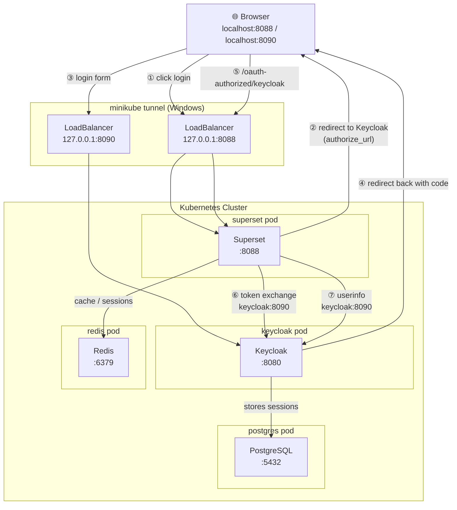

### Superset + Keycloak

Apache Superset with Keycloak OAuth2 authentication in Docker.

### Quick Start

```bash
docker-compose up -d
```

Access:

- Superset: http://localhost:8088
- Keycloak: http://localhost:XXXX
- Login: `admin` / `admin`

### Architecture

```
Browser → Superset:8088 ↔ Keycloak:XXXX
    ↓              
    Redis      
```

## How It Works

**Authentication**: OAuth2 flow between Superset and Keycloak

- `superset_config.py` configures OAuth provider and role mapping
- `realm-import/*.json` defines Keycloak realm, users, and client

**Sessions**: Stored in Redis

**Roles**: Keycloak roles → Superset permissions

- `admin`/`realm-admin` → Admin
- Others → Gamma (basic user)

**URLs**:

- Internal (containers): `keycloak:8080`
- External (browser): `localhost:8090`

## Key Files

- `docker-compose.yml` - Services: Superset, Redis
- `superset_config.py` - OAuth config, security manager, session/cache setup
- `realm-import/*.json` - Keycloak realm with users and client config
- `Dockerfile` - Superset image with dependencies

## Configuration Highlights

**Superset (`superset_config.py`)**:

- OAuth provider points to Keycloak endpoints
- CustomSecurityManager maps Keycloak roles to Superset
- Redis for sessions and cache
- SQLite for metadata

**Keycloak (`realm-import`)**:

- Client: `superset` with secret
- Redirect URIs: `http://localhost:8088/*`
- Protocol mapper: exposes roles in JWT token

**Docker Compose**:

- Network: All containers on `app-network`
- Health checks ensure services start in order
- Volume mounts for configs and persistence

## Check services

docker-compose ps

# View logs

docker-compose logs -f superset
docker-compose logs -f keycloak

# Kubernetes Pods Flowchart

