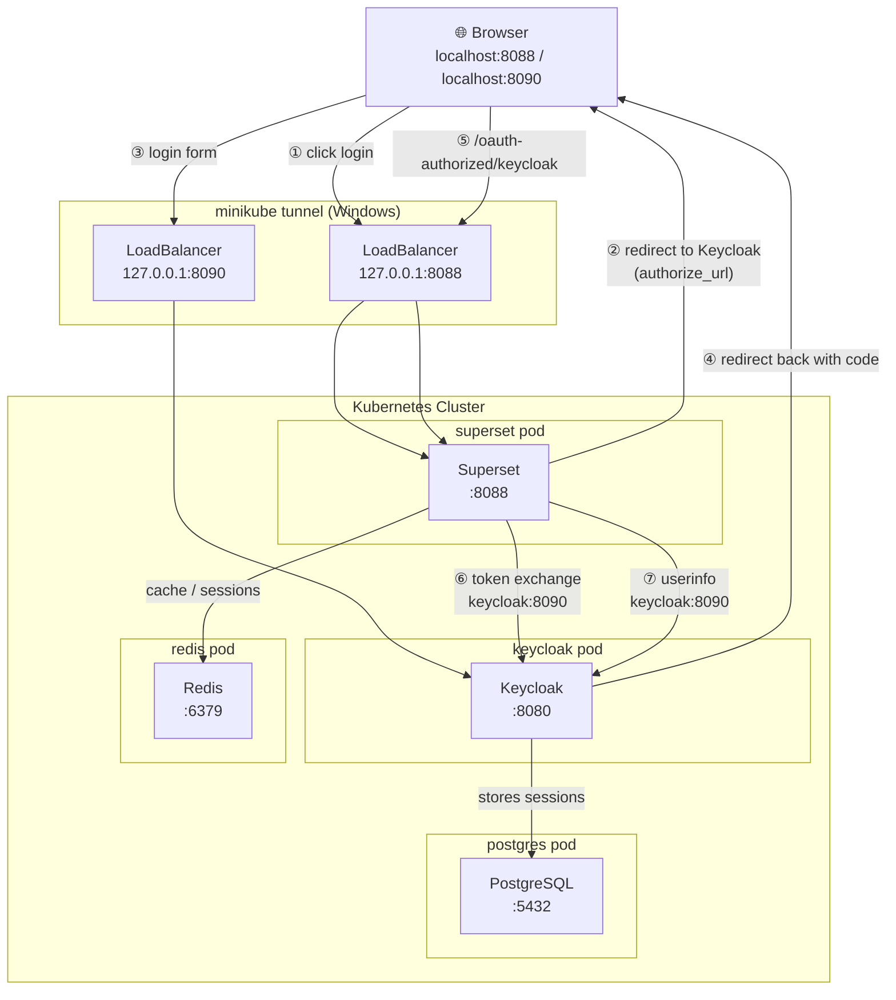

### Superset + Keycloak

Apache Superset with Keycloak OAuth2 authentication in Docker.

### Quick Start

```bash
docker-compose up -d
```

Access:

- Superset: http://localhost:8088
- Keycloak: http://localhost:XXXX
- Login: `admin` / `admin`

### Architecture

```
Browser → Superset:8088 ↔ Keycloak:XXXX
    ↓              
    Redis      
```

## How It Works

**Authentication**: OAuth2 flow between Superset and Keycloak

- `superset_config.py` configures OAuth provider and role mapping
- `realm-import/*.json` defines Keycloak realm, users, and client

**Sessions**: Stored in Redis

**Roles**: Keycloak roles → Superset permissions

- `admin`/`realm-admin` → Admin
- Others → Gamma (basic user)

**URLs**:

- Internal (containers): `keycloak:8080`
- External (browser): `localhost:8090`

## Key Files

- `docker-compose.yml` - Services: Superset, Redis
- `superset_config.py` - OAuth config, security manager, session/cache setup
- `realm-import/*.json` - Keycloak realm with users and client config
- `Dockerfile` - Superset image with dependencies

## Configuration Highlights

**Superset (`superset_config.py`)**:

- OAuth provider points to Keycloak endpoints
- CustomSecurityManager maps Keycloak roles to Superset
- Redis for sessions and cache
- SQLite for metadata

**Keycloak (`realm-import`)**:

- Client: `superset` with secret
- Redirect URIs: `http://localhost:8088/*`
- Protocol mapper: exposes roles in JWT token

**Docker Compose**:

- Network: All containers on `app-network`
- Health checks ensure services start in order
- Volume mounts for configs and persistence

## Check services

docker-compose ps

# View logs

docker-compose logs -f superset
docker-compose logs -f keycloak

# Run Kubernetes Services
# Superset Dashboard — Deployment Guide

## 🚀 First-Time Setup

```powershell
# 1. Start Minikube (Docker Desktop must be running)
minikube start

# 2. Build & load image into Minikube
docker build -t superset:latest .
minikube image load superset:latest

# 3. Apply manifests
cd k8_manifests
kubectl apply -f configmap.yaml
kubectl apply -f superset-config.yaml
kubectl apply -f postgres.yaml
kubectl apply -f redis.yaml
kubectl apply -f keycloak.yaml
kubectl apply -f superset.yaml

# 4. Watch pods (wait until all Running)
kubectl get pods -w

# 5. Expose services — run in a separate terminal
minikube tunnel
```

Superset → `http://localhost:8088` | Keycloak → `http://localhost:8090`

---

## 🔄 Teardown & Redeploy

```powershell
# Delete
kubectl delete -f env-configmap.yaml -f superset-config.yaml -f keycloak.yaml -f superset.yaml -f redis.yaml -f postgres.yaml

# Redeploy
kubectl apply -f env-configmap.yaml -f superset-config.yaml -f postgres.yaml -f redis.yaml -f keycloak.yaml -f superset.yaml
```

---

## ☁️ AWS — Values to Update

| File | Key | Value |
|------|-----|-------|
| `env-configmap.yaml` | `KEYCLOAK_EXTERNAL_URL` | `http://<keycloak-elb-dns>:8090` |
| `env-configmap.yaml` | `SUPERSET_EXTERNAL_URL` | `http://<superset-elb-dns>:8088` |
| `superset-config.yaml` | `OVERWRITE_REDIRECT_URI` | `http://<superset-elb-dns>:8088/oauth-authorized/keycloak` |
| `keycloak.yaml` | `KC_HOSTNAME` | `<keycloak-elb-dns>` |
| `keycloak.yaml` | `redirectUris` | `http://<superset-elb-dns>:8088/*` |

> No `minikube tunnel` needed on AWS — ELBs are provisioned automatically.  
> Internal URLs (Redis, Postgres, `KEYCLOAK_INTERNAL_URL`) never change.


# Kubernetes Pods Flowchart



# Moving to AWS

ELB DNS names are assigned automatically — no `minikube tunnel` needed. Only update these values:

| File | What to change |
|------|---------------|
| `env-configmap.yaml` | `KEYCLOAK_EXTERNAL_URL` and `SUPERSET_EXTERNAL_URL` — change `http` → `https` |
| `superset-config.yaml` | `OVERWRITE_REDIRECT_URI` — change `http` → `https`, set `ENABLE_PROXY_FIX = True`, `SESSION_COOKIE_SECURE = True` |
| `keycloak.yaml` | `KC_HOSTNAME` to ELB DNS, `redirectUris` + `webOrigins` to `https`, set `KC_HOSTNAME_STRICT_HTTPS: "true"` and `KC_HTTP_ENABLED: "false"` |

Everything else (internal Redis, Postgres, Keycloak pod-to-pod URLs) stays the same.

 Variable | Local (current) | Production (required) |
|---|---|---|
| `KEYCLOAK_EXTERNAL_URL` | `http://localhost:8090` | `https://id.soilwise.wetransform.eu` |
| `SUPERSET_EXTERNAL_URL` | `http://localhost:8088` | `https://superset.soilwise.wetransform.eu` |
| `KEYCLOAK_REDIRECT_URIS` | `http://localhost:8088/*` | `https://superset.soilwise.wetransform.eu/*` |
| `KEYCLOAK_WEB_ORIGINS` | `http://localhost:8088` | `https://superset.soilwise.wetransform.eu` |
| `SUPERSET_SECRET_KEY` | existing value | Generate new: `openssl rand -base64 42` |
| `KEYCLOAK_CLIENT_SECRET` | `Z2Gen97MXT3Zdpkc4ZIgipWc4blBaTwu` | Verify against Keycloak Admin UI |

```dotenv
# Production .env values
KEYCLOAK_EXTERNAL_URL=https://id.soilwise.wetransform.eu
SUPERSET_EXTERNAL_URL=https://superset.soilwise.wetransform.eu
KEYCLOAK_REDIRECT_URIS=https://superset.soilwise.wetransform.eu/*
KEYCLOAK_WEB_ORIGINS=https://superset.soilwise.wetransform.eu

# Internal pod communication (keep as is)
KEYCLOAK_INTERNAL_URL=http://keycloak:8080
SUPERSET_INTERNAL_URL=http://superset:8088

# Generate a new secret key
SUPERSET_SECRET_KEY=<run: openssl rand -base64 42>

# Verify this matches Keycloak → Clients → superset → Credentials tab
KEYCLOAK_CLIENT_SECRET=Z2Gen97MXT3Zdpkc4ZIgipWc4blBaTwu
```

---

## 2. `superset_config.py`

```python
# CHANGE THIS (required for HTTPS)
SESSION_COOKIE_SECURE = True  # was False
```

---

## 3. Keycloak Client Settings (Admin UI)

Navigate to: **Keycloak Admin → Clients → superset → Settings tab**

```
Valid Redirect URIs:
  https://superset.soilwise.wetransform.eu/*

Valid Post Logout Redirect URIs:
  https://superset.soilwise.wetransform.eu/*

Web Origins:
  https://superset.soilwise.wetransform.eu
```

---

## 4. Keycloak Internal URL (Kubernetes)

Verify the Keycloak service name inside your cluster:

```bash
kubectl get services -n 
```

Then update if needed:

```dotenv
KEYCLOAK_INTERNAL_URL=http://<keycloak-service-name>.<namespace>.svc.cluster.local:8080
```

---

## 5. Verify Client Secret

```
Keycloak Admin → Clients → superset → Credentials tab
→ Client Secret must match KEYCLOAK_CLIENT_SECRET in your .env
```

---

## Why These Changes Matter

| Issue | Consequence if not fixed |
|---|---|
| `localhost` URLs in env | OAuth redirects go to wrong address, login fails |
| `SESSION_COOKIE_SECURE = False` | Cookies rejected by browser over HTTPS |
| Wrong Redirect URIs in Keycloak | Keycloak blocks login redirect (security policy) |
| Wrong Web Origins | CORS errors when Superset calls Keycloak |
| Mismatched Client Secret | Token exchange fails silently |